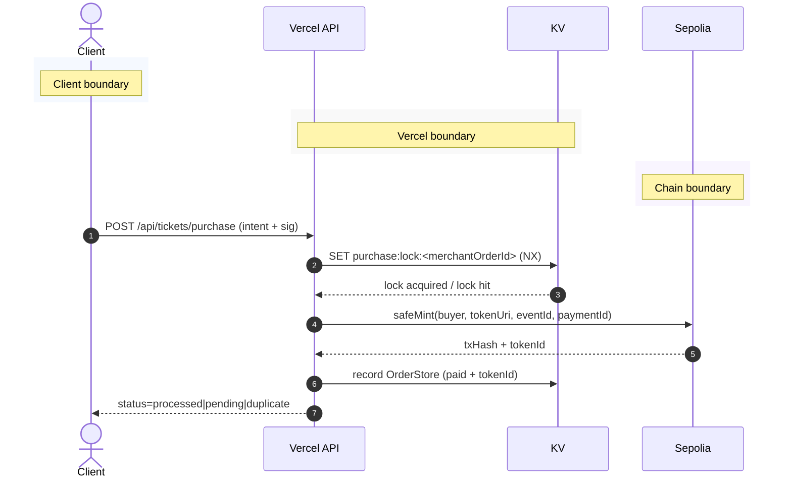
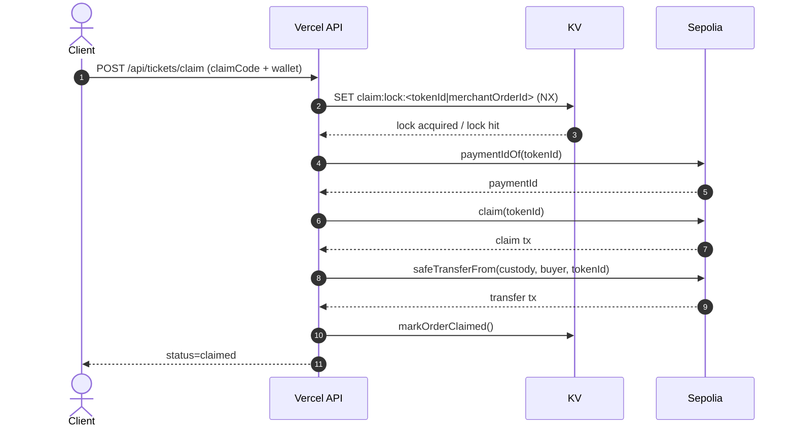
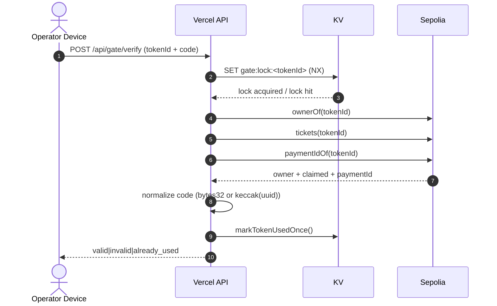

# Architecture

## Purchase Flow

## Claim Flow

## Gate Verify Flow

### Notes
- Trust boundaries: Client/Operator devices, Vercel API, KV storage, Sepolia chain.
- Idempotency locks: `purchase:lock`, `claim:lock`, `gate:lock`.
- Gate invalid attempts tracked with `gate:verify:invalid` + temporary lock.
