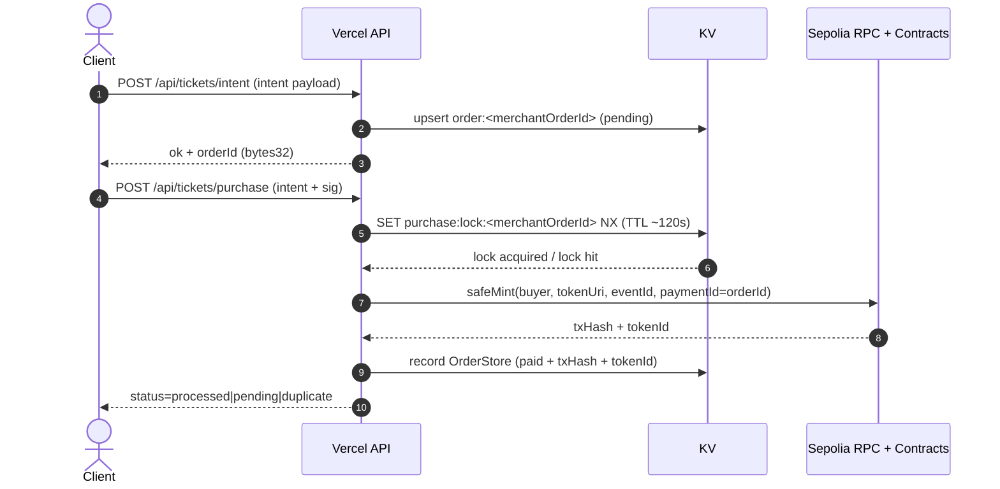
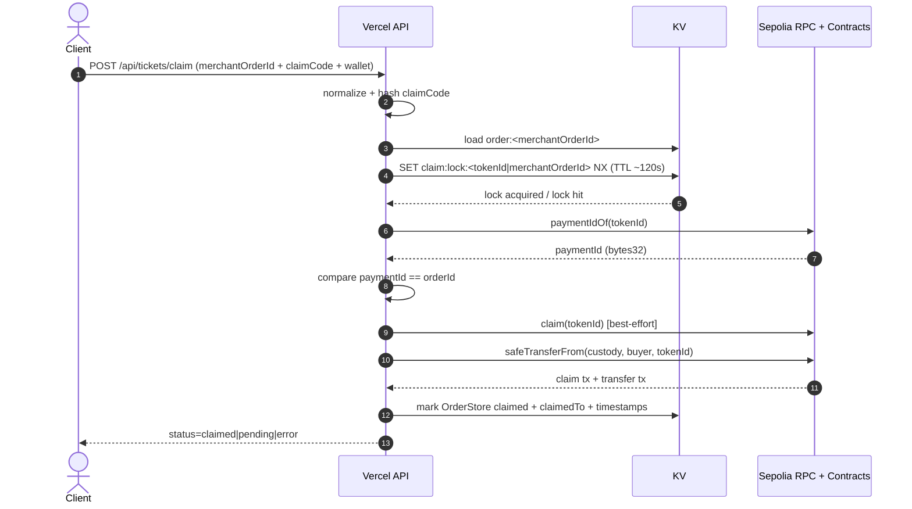
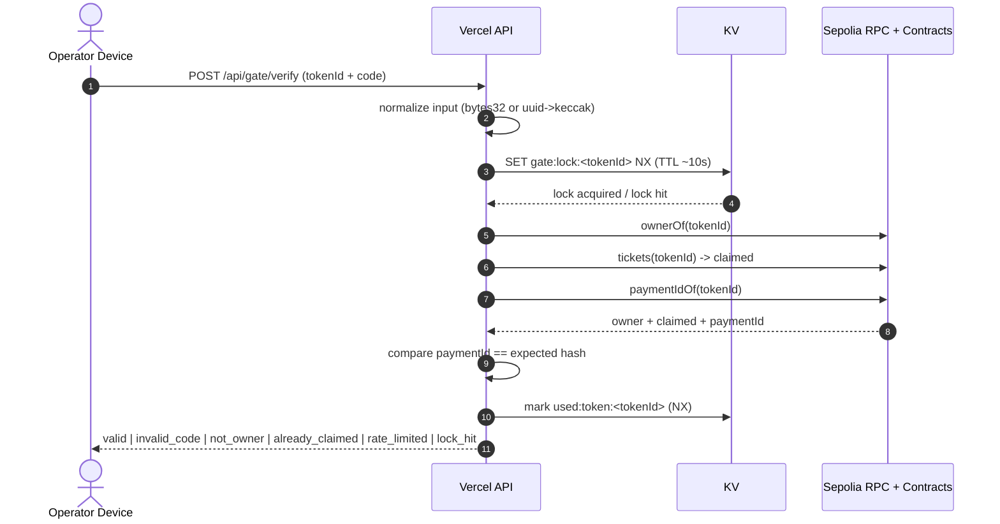

# Final Architecture

This document is the single-source description of the gate + claim + purchase architecture for the Next.js App Router app using Vercel KV and Sepolia.

## Purchase Flow (Intent -> Purchase -> Mint)


## Claim Flow (Custody -> Buyer Transfer)


## Gate Verify Flow (One-time Scan)


## Components & Trust Boundaries
```mermaid
flowchart LR
  subgraph Untrusted_Clients[Untrusted Boundary]
    Client[Client Browser]
    Operator[Operator Device]
  end

  subgraph Vercel[Trusted App Boundary (Vercel)]
    API[Vercel API Routes]
    KV[(Vercel KV / Redis)]
  end

  subgraph Chain[External Trust Boundary (Sepolia)]
    RPC[Sepolia RPC]
    Contracts[EventTicket + TicketSale]
  end

  Client -->|/api/tickets/intent| API
  Client -->|/api/tickets/purchase| API
  Client -->|/api/tickets/claim| API
  Operator -->|/api/gate/verify| API

  API <--> KV
  API --> RPC --> Contracts
```

## Locks & Idempotency
- `purchase:lock:<merchantOrderId>` (in `/api/tickets/purchase`): prevents duplicate minting for the same merchant order. Lock hit returns `status=pending` and should be retried after TTL (~120s).
- `claim:lock:<tokenId|merchantOrderId>` (in `/api/tickets/claim`): ensures claim/transfer is processed once. Lock hit returns HTTP 202 with `status=pending`; client should retry after TTL (~120s).
- `gate:lock:<tokenId>` (in `/api/gate/verify`): short-lived anti-spam lock for gate scans. Lock hit returns `reason=temporarily_locked` and should be retried after TTL (~10s).
- Additional gate anti-abuse lock: `gate:verify:lock:<tokenId>` is set after repeated invalid codes to rate-limit brute force (see `docs/gate-scan-protocol.md`).

## Data Model & Keys
- OrdersStore fields (primary): `merchantOrderId`, `orderId` (bytes32), `paymentId` (bytes32, equals `orderId`), `txHash`, `tokenId`, `claimed` (stored as `claimStatus` + timestamps), `createdAt`, `updatedAt`, plus claim metadata.
- KV keys:
  - `order:<merchantOrderId>` -> Order record
  - `order:token:<tokenId>` -> `merchantOrderId`
- On-chain mapping:
  - `paymentIdOf(tokenId) == orderId (bytes32)`

## Security Controls
- Gate operator auth via `x-operator-key` in production.
- Sensitive endpoints return `Cache-Control: no-store` via `jsonNoStore`.
- Debug fields disabled in production unless `ENABLE_PROD_DEBUG` / `GATE_VERIFY_DEBUG` are explicitly enabled.
- Server env validation enforced for custody and RPC configuration.
